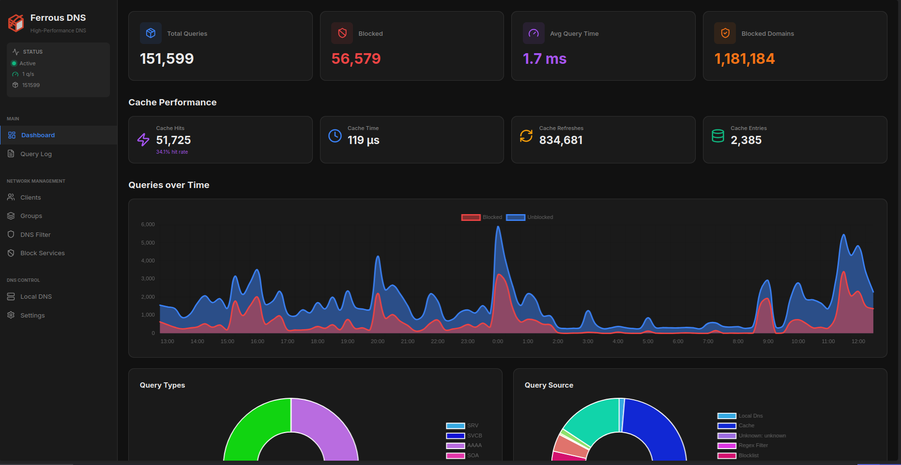

<div align="center">

# 🦀 Ferrous DNS

**A blazingly fast, memory-safe DNS server with network-wide ad-blocking**

[](https://github.com/ferrous-networking/Ferrous-DNS/actions/workflows/ci.yml)
[](https://github.com/ferrous-networking/Ferrous-DNS/actions/workflows/docker.yml)
[](https://codecov.io/gh/ferrous-networking/Ferrous-DNS)
[](https://hub.docker.com/r/andersonviudes/ferrous-dns)
[](https://opensource.org/licenses/MIT)
[](https://opensource.org/licenses/Apache-2.0)
[](https://www.rust-lang.org/)
[](https://github.com/ferrous-networking/Ferrous-DNS/issues)
[](https://github.com/ferrous-networking/Ferrous-DNS/stargazers)

*Modern alternative to Pi-hole and AdGuard Home, built with Rust*

[Features](#-features) • [Installation](#-installation) • [Docker](#-docker) • [Roadmap](ROADMAP.md)

</div>

---

## 📖 About

Ferrous DNS is a modern, high-performance DNS server with built-in ad-blocking capabilities. Written in Rust, it offers superior performance and memory safety compared to traditional solutions like Pi-hole and AdGuard Home.

**Key capabilities:**
- ⚡ **High Performance** - 2x faster than Pi-hole with 50% lower latency
- 🛡️ **Memory Safe** - Zero memory vulnerabilities thanks to Rust
- 🌐 **Full DNS Implementation** - RFC 1035 compliant with support for A, AAAA, CNAME, MX, TXT, PTR records
- 🔒 **Secure DNS** - DNS-over-HTTPS (DoH) and DNS-over-TLS (DoT) support
- 🚫 **Ad Blocking** - Network-wide blocking of ads, trackers, and malware
- 📊 **Modern Dashboard** - Real-time statistics with beautiful UI (HTMX + Alpine.js + TailwindCSS)
- 🔄 **REST API** - Complete API for automation and integration
- ⚡ **Smart Caching** - L1/L2 hierarchical cache with LFUK eviction
- 🐳 **Docker Ready** - Easy deployment with Docker and Docker Compose

---

## 🚀 Installation

### 🐳 Docker

Quick start with Docker:

```bash
docker run -d \
  --name ferrous-dns \
  -p 53:53/udp \
  -p 8080:8080 \
  ghcr.io/andersonviudes/ferrous-dns:latest
```

Access the dashboard at `http://localhost:8080`

### 🐳 Docker Compose

Create a `docker-compose.yml` file:

```yaml
version: '3.8'

services:
  ferrous-dns:
    image: andersonviudes/ferrous-dns:latest
    container_name: ferrous-dns
    restart: always
    network_mode: host
    user: root
    environment:
      # Config file (opcional - só usa se existir)
      - FERROUS_CONFIG=/data/config/ferrous-dns.toml
      # Database
      - FERROUS_DATABASE=/data/db/ferrous.db
      # Network
      - FERROUS_DNS_PORT=53
      - FERROUS_WEB_PORT=8080
      - FERROUS_BIND_ADDRESS=0.0.0.0
      # Logging
      - FERROUS_LOG_LEVEL=info
      # Timezone
      - TZ=America/Sao_Paulo
    dns:
      - 10.0.0.1
    cap_add:
      - NET_ADMIN
      - SYS_TIME
      - SYS_NICE
      - NET_BIND_SERVICE
    volumes:
      - ferrous-data:/data/

volumes:
  ferrous-data:
```

Start the service:

```bash
docker-compose up -d
```

### ⚙️ Configuration

#### Environment Variables

| Variable | Default | Description |
|----------|---------|-------------|
| `FERROUS_CONFIG` | - | Path to config file |
| `FERROUS_DNS_PORT` | `53` | DNS server port |
| `FERROUS_WEB_PORT` | `8080` | Web dashboard port |
| `FERROUS_BIND_ADDRESS` | `0.0.0.0` | Bind address |
| `FERROUS_DATABASE` | `/var/lib/ferrous-dns/ferrous.db` | Database path |
| `FERROUS_LOG_LEVEL` | `info` | Log level (debug, info, warn, error) |

#### Custom Configuration Example

```bash
docker run -d \
  --name ferrous-dns \
  --restart always \
  --network host \
  --user root \
  -e FERROUS_CONFIG=/data/config/ferrous-dns.toml \
  -e FERROUS_DATABASE=/data/db/ferrous.db \
  -e FERROUS_DNS_PORT=53 \
  -e FERROUS_WEB_PORT=8080 \
  -e FERROUS_BIND_ADDRESS=0.0.0.0 \
  -e FERROUS_LOG_LEVEL=info \
  -e TZ=America/Sao_Paulo \
  --dns 10.0.0.1 \
  --cap-add NET_ADMIN \
  --cap-add SYS_TIME \
  --cap-add SYS_NICE \
  --cap-add NET_BIND_SERVICE \
  andersonviudes/ferrous-dns:latest
```

---

## 🗺️ Roadmap

Check out our [detailed roadmap](ROADMAP.md) to see what's planned for future releases.

---

## 🦀 Ferrous DNS




## 🤝 Contributing

Contributions are welcome! Please feel free to submit issues, feature requests, or pull requests.

- **Report bugs**: [GitHub Issues](https://github.com/ferrous-networking/Ferrous-DNS/issues)
- **Discussions**: [GitHub Discussions](https://github.com/ferrous-networking/Ferrous-DNS/discussions)

---

## 📄 License

This project is dual-licensed under:
- [MIT License](https://opensource.org/licenses/MIT)
- [Apache License 2.0](https://opensource.org/licenses/Apache-2.0)

You may choose either license for your use.

---

<div align="center">

**Made with ❤️ and 🦀 by [Anderson Viudes](https://github.com/andersonviudes)**

If you find this project useful, please consider giving it a ⭐

[⬆ Back to Top](#-ferrous-dns)

</div>
