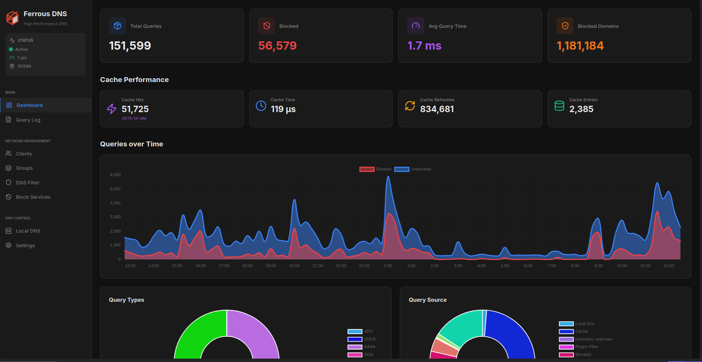

<div align="center">


# Ferrous DNS

**High-performance DNS server with network-wide ad-blocking, written in Rust**

[](https://github.com/ferrous-networking/Ferrous-DNS/actions/workflows/ci.yml)
[](https://hub.docker.com/r/andersonviudes/ferrous-dns)
[](https://opensource.org/licenses/MIT)
[](https://opensource.org/licenses/Apache-2.0)

[Documentation](https://ferrous-networking.github.io/Ferrous-DNS/) • [Quick Start](https://ferrous-networking.github.io/Ferrous-DNS/getting-started/quick-start/) • [Configuration](https://ferrous-networking.github.io/Ferrous-DNS/configuration/) • [Benchmarks](https://ferrous-networking.github.io/Ferrous-DNS/performance/benchmarks/) • [Roadmap](ROADMAP.md)

</div>

---

## Documentation

Full documentation is available at **[ferrous-networking.github.io/Ferrous-DNS](https://ferrous-networking.github.io/Ferrous-DNS/)**.

## Performance

At **482,506 queries/second** under identical Docker conditions (16 CPUs, cache enabled, log info, rate limiting disabled), Ferrous-DNS is **4.9× faster than AdGuard Home**, **4.7× faster than Blocky**, and **233× faster than Pi-hole** — all running a full feature stack (DNS server, REST API, Web UI, SQLite query log, blocking engine) in a single process. PowerDNS Recursor (884K QPS) and Unbound (952K QPS) lead as purpose-built pure recursive resolvers with no additional features.

[Full benchmark report](https://ferrous-networking.github.io/Ferrous-DNS/performance/benchmarks/)

---

## Features

**Performance**
- L1/L2 hierarchical cache — thread-local lock-free L1 + sharded DashMap L2 with LFUK eviction and Bloom filter for negative lookups
- In-flight coalescing — deduplicates concurrent queries for the same domain to a single upstream request
- Single binary — DNS server, REST API, and Web UI in one process; no extra dependencies

**Encrypted DNS**
- Upstream: plain UDP, DoH, DoT, DoQ, and HTTP/3
- Server (listener): DoH and DoT — serve encrypted DNS directly to clients
- IPv6 upstreams and DNS-name resolvers (e.g. `dns.google.com` resolved at startup)

**Blocking & Filtering**
- Blocklists with regex patterns and wildcard domains (`*.ads.com`)
- Allowlist
- 1-click blockable service categories
- CNAME cloaking detection — catches trackers hiding behind first-party CNAMEs
- Safe Search enforcement for Google, Bing, YouTube, and others

**Client Management**
- Auto client detection by IP and MAC address
- Client groups with independent policies (e.g. kids, work, IoT)
- Per-group parental controls with time-based scheduling
- Conditional forwarding — route specific domains to internal resolvers

**Security**
- HTTPS for dashboard and REST API (single port, automatic HTTP → HTTPS redirect)
- Session-based authentication (login/logout with rate limiting)
- Named API tokens (SHA-256 hashed, `X-Api-Key` header)
- First-run setup wizard for password configuration
- Self-signed certificate generation from the UI
- DNSSEC validation
- DNS rebinding protection
- PROXY Protocol v2 support

**Compatibility & Deployment**
- Pi-hole API compatibility — works as a drop-in replacement for existing integrations
- Docker multi-arch images (amd64, arm64)
- RFC 1035 compliant: A, AAAA, CNAME, MX, TXT, PTR, NS, SRV, and local DNS records
- Auto PTR generation for local A records

---

## Installation

### Docker

```bash
docker run -d \
  --name ferrous-dns \
  --restart always \
  --network host \
  --user root \
  -e FERROUS_CONFIG=/data/config/ferrous-dns.toml \
  -e FERROUS_DATABASE=/data/db/ferrous.db \
  -e FERROUS_DNS_PORT=53 \
  -e FERROUS_WEB_PORT=8080 \
  -e FERROUS_BIND_ADDRESS=0.0.0.0 \
  -e FERROUS_LOG_LEVEL=info \
  -e TZ=America/Sao_Paulo \
  --dns 10.0.0.1 \
  --cap-add NET_ADMIN \
  --cap-add SYS_TIME \
  --cap-add SYS_NICE \
  --cap-add NET_BIND_SERVICE \
  andersonviudes/ferrous-dns:latest
```

Access the dashboard at `http://localhost:8080`

### Docker Compose

```yaml
services:
  ferrous-dns:
    image: andersonviudes/ferrous-dns:latest
    container_name: ferrous-dns
    restart: always
    network_mode: host
    user: root
    environment:
      - FERROUS_CONFIG=/data/config/ferrous-dns.toml
      - FERROUS_DATABASE=/data/db/ferrous.db
      - FERROUS_DNS_PORT=53
      - FERROUS_WEB_PORT=8080
      - FERROUS_BIND_ADDRESS=0.0.0.0
      - FERROUS_LOG_LEVEL=info
      - TZ=America/Sao_Paulo
    dns:
      - 10.0.0.1
    cap_add:
      - NET_ADMIN
      - SYS_TIME
      - SYS_NICE
      - NET_BIND_SERVICE
    volumes:
      - ferrous-data:/data/

volumes:
  ferrous-data:
```

```bash
docker compose up -d
```

### Configuration

#### Environment Variables

| Variable              | Default                               | Description                         |
|:----------------------|:--------------------------------------|:------------------------------------|
| `FERROUS_CONFIG`      | —                                     | Path to TOML config file (optional) |
| `FERROUS_DNS_PORT`    | `53`                                  | DNS server port                     |
| `FERROUS_WEB_PORT`    | `8080`                                | Web dashboard port                  |
| `FERROUS_BIND_ADDRESS`| `0.0.0.0`                             | Bind address                        |
| `FERROUS_DATABASE`    | `/var/lib/ferrous-dns/ferrous.db`     | SQLite database path                |
| `FERROUS_LOG_LEVEL`   | `info`                                | Log level: debug, info, warn, error |

---

## Dashboard



---

## Contributing

Bug reports, feature requests, and pull requests are welcome.

- Issues: [GitHub Issues](https://github.com/ferrous-networking/Ferrous-DNS/issues)
- Discussions: [GitHub Discussions](https://github.com/ferrous-networking/Ferrous-DNS/discussions)
- Docs: [Contributing Guide](https://ferrous-networking.github.io/Ferrous-DNS/contributing/)
